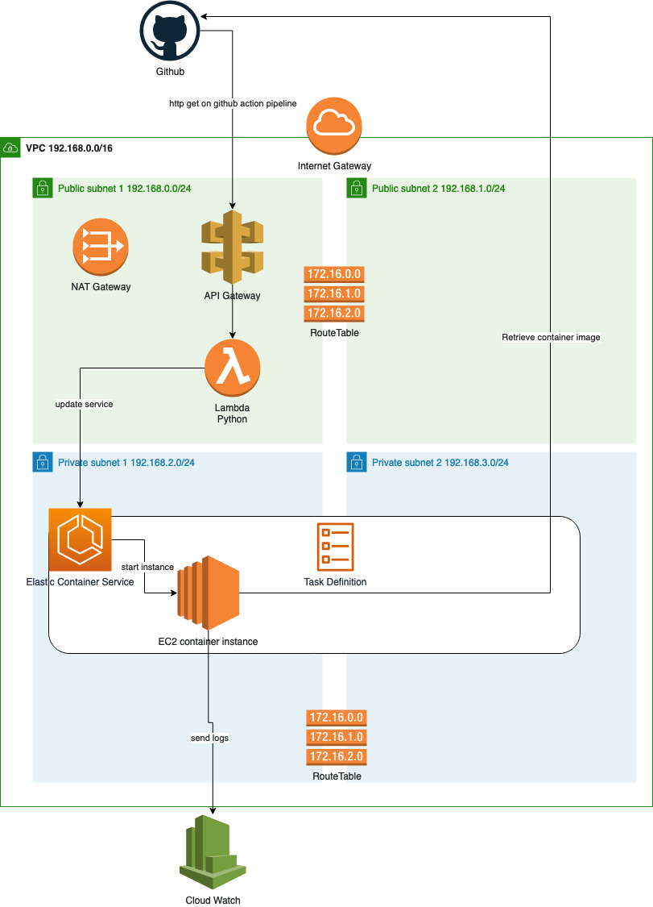

# AWS setup

This terraform script installs a [discord bot for Blackjack](https://github.com/oglimmer/discord-bot-bj) into AWS. It provides an endpoint to update the ECS service from a github action pipeline.

## Overview diagram

 

## Used services

Using: ECS (Fargate), CloudWatch, VPC, SG, Subnets, NAT-Gateway, Elastic IP

## Prerequisites

* Root user or IAM user with [these](PERMISSIONS.md) API permissions
* Setup AWS_ACCESS_KEY_ID, AWS_SECRET_ACCESS_KEY (e.g. aws configure)
* Modify terraform/main.cf for a different backend

## How to

* Change into terraform and exec `./genesis.sh all` to set up everything

